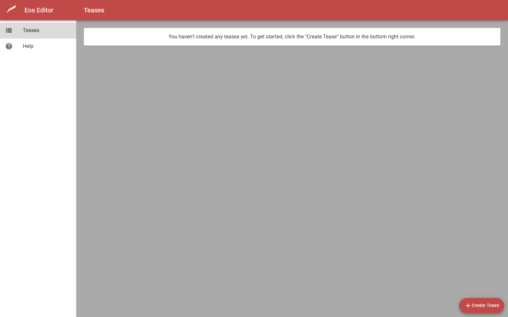
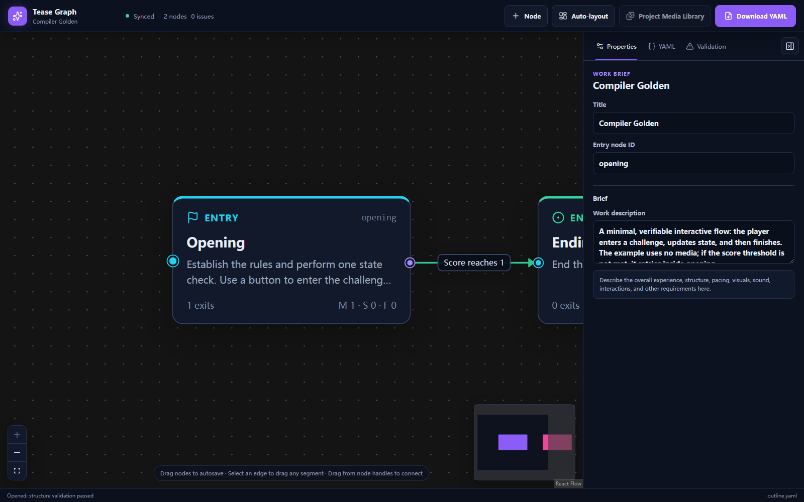

# Vibe MiloTease

[简体中文](README.zh-CN.md)

**Vibe MiloTease** is a local-first authoring toolkit for creating, editing, validating, previewing, and deploying interactive **Milovana EOS WebTeases**.

It combines an AI-oriented authoring skill, a structured source format called **Milo IR**, a visual **Tease Graph**, a local MiloAIEditor host, media tooling, validation/compilation, Preview, legacy EOS migration, and a browser-assisted deployment workflow.

The project is designed for teases that have grown beyond what is comfortable to maintain as one large EOSScript document. Instead of treating generated `eosscript.json` as the authoring source, Vibe MiloTease separates design, executable source, generated output, media, and graph layout into explicit files that can be reviewed and revised independently.

```text
Idea → Outline → Milo IR → build / validate → Preview → Deploy
```

- **Outline** describes the experience structure, node purpose, and allowed routes.
- **Milo IR** is the editable executable source.
- **`eosscript.json`** is generated output in Milo IR projects.
- **Tease Graph** provides a visual view of the Outline and its branches.
- **MiloAIEditor** hosts the local EOS Editor, Preview runtime, compiler, media workflows, and deployment integration.

## Why use Vibe MiloTease?

Large EOS projects can contain many pages, branches, choices, timers, variables, media references, conditions, reusable scenes, preload rules, and endings. Editing all of that directly in generated EOSScript makes structural changes difficult to reason about and easy to break.

Vibe MiloTease adds a source-oriented layer around EOS authoring:

- keep high-level structure in `outline.yaml`;
- keep global state and reusable definitions in `milo.yaml`;
- split node-specific behavior across `src/*.milo.yaml`;
- validate references and structure before replacing generated EOSScript;
- inspect branching visually with Tease Graph;
- Preview the compiled result locally;
- migrate existing legacy EOS projects where equivalence can be preserved;
- let an AI coding/authoring agent work against explicit project sources instead of rewriting one opaque JSON document.

## AI-assisted, not one-click generation

Vibe MiloTease was created to make AI a practical assistant for building WebTeases, not to promise that a finished tease can be generated from a single sentence.

A good tease still needs a human idea behind it. The user needs to decide what kind of experience they want, how it should feel, how it should progress, what choices or rules matter, and what should change when the result does not feel right. In practice, authoring is iterative:

```text
Idea → Outline → Draft → Preview → Feedback → Revision → Preview again
```

Current AI models are often quite good at the technical side of the work: writing code, following schemas, connecting branches, transforming repetitive structures, fixing validation errors, and refactoring project files. Creative writing is less predictable. Dialogue can become generic, overly formal, repetitive, tonally inconsistent, or simply strange. Pacing and emotional beats may also miss the author's intent.

For that reason, AI-generated text should be treated as a draft rather than a finished work. Good results usually require continued prompting and specific feedback: shorten a passage, change the tone, make a character less formal, rewrite an awkward exchange, adjust pacing, or replace an entire scene that does not work.

Vibe MiloTease works best for users who bring their own concept and taste, and who are willing to review, Preview, revise, and repeat. If the goal is a one-line "make me a tease" command that produces something immediately ready to publish, this project is not designed to provide that.

The project itself also still has rough edges and limitations. It should be considered an evolving authoring toolkit rather than a finished replacement for human creative work or for careful testing in the Milovana editor.

## Screenshots

### MiloAIEditor



The local MiloAIEditor hosts the Milovana EOS Editor integration, project browser, Preview runtime, compiler endpoints, media tools, and deployment workflow. The screenshot above is captured from an empty local workspace and contains no user project data.

### Tease Graph



Tease Graph visualizes Outline nodes and routes and provides graph-aware editing tools. The screenshot uses the repository's built-in golden example rather than a personal project.

## Main features

### Milo IR structured authoring

Milo IR is the editable executable source format used by Vibe MiloTease. It supports full EOSScript YAML together with optional shorthand for repeated authoring patterns.

A Milo IR project can represent:

- pages and scenes;
- text, notifications, timers, choices, conditions, and random behavior;
- variables and persistent state;
- media resources and project media;
- reusable assets and initialization;
- JavaScript expressions preserved as inert source during compilation;
- branches, loops, failure routes, and endings.

The compiler parses and validates author sources, expands supported shorthand, materializes media, validates the resulting EOS structure, and atomically replaces `eosscript.json`. A failed build preserves the last successful generated output.

### Visual Tease Graph

Tease Graph provides a visual representation of `outline.yaml` and supports graph-oriented editing of nodes and routes.

Included outline templates cover several common structures, including linear phases, chapter/schedule layouts, hub-and-mission loops, resource/RPG progression, random event pools, and exploration-style layouts.

### Local MiloAIEditor

MiloAIEditor is a FastAPI-based local host for:

- the Milovana EOS Editor frontend;
- Preview;
- Tease Graph;
- Milo IR parsing, validation, and compilation;
- project storage and history;
- media search/import workflows;
- Milovana browsing and deployment integration.

The provided Windows startup script binds to `127.0.0.1`, so the editor is not exposed to the network by default.

### Legacy EOS migration

Existing `legacy-eos` projects can continue using editable `eosscript.json`. The migration workflow attempts to reconstruct Milo sources and only switches the project to Milo IR mode when the rebuilt EOS JSON is deeply equivalent to the original parsed script.

### Media workflow

The repository contains helpers for media search/fetching, project import, image description, image-to-terminal conversion, video processing, rich-text media handling, and frontend asset capture.

Use only media you are authorized to access and redistribute.

## Included Tools

`skills/miloai-tease/tools/` contains a set of supporting utilities used by the Skill, MiloAIEditor, and more advanced authoring workflows. These are not all required for a basic project, but they make several repetitive or specialized tasks reproducible.

| Tool | Purpose | Typical use |
| --- | --- | --- |
| `milo_workflow/` | Local workflow bridge for creating projects, building Milo IR, validating, migrating legacy projects, starting the editor when needed, and opening Preview. | Day-to-day authoring and AI Agent workflows. |
| `import_project/` | Imports an existing EOS project and its media into the local project workspace without modifying the original source directory. | Bringing an existing tease into MiloAIEditor for further work. |
| `image_describer/` | Batch-describes image directories with an AI model and writes matching Markdown descriptions plus a manifest. Supports recursion, concurrency, rate limiting, retries, and dry runs. | Giving an AI Agent searchable textual context for large image collections. |
| `image_to_half_block/` | Converts an image into compact, precomputed colored Unicode half-block data for Milo Say. | Rendering small static image-like visuals through text/terminal-style output. |
| `rich_text/` | Converts image content into character/color matrix data using the bundled Node tooling. | Preparing image-derived data for rich-text rendering experiments and authored effects. |
| `video_to_eos/` | Converts a video into a timed EOS image-sequence WebTease project, including extracted frame media and generated EOS structure. | Experimental video-style playback inside EOS constraints. |
| `capture_frontend/` | Captures the current Milovana EOS Editor frontend and referenced assets into the local editor tree and records hashes in a manifest. | Maintainer/development work when refreshing the locally hosted editor frontend. |

The most generally useful command-line entry point is `milo_workflow.py`:

```powershell
python skills/miloai-tease/tools/milo_workflow/milo_workflow.py --help
```

For batch image understanding:

```powershell
python skills/miloai-tease/tools/image_describer/describe_images.py --help
```

Some tools have additional runtime or dependency requirements. For example, `image_describer` expects a compatible local model endpoint as described in its own README, `rich_text` uses Node packages, and `video_to_eos` depends on the bundled Python media stack. Treat `capture_frontend` as a maintainer utility rather than a normal authoring command because it mirrors assets from the live Milovana site.

## Recommended Workflow: Let AI Build It With You

Vibe MiloTease is designed to work best with a capable AI agent that can read and modify local project files and run commands. You provide the ideas, materials, and feedback; the AI handles the project structure and technical implementation.

Start by asking the AI to load:

```text
skills/miloai-tease/SKILL.md
```

Then clearly tell it which project to create or modify. For an existing project, provide the exact project ID or project path instead of asking the AI to guess.

After that, describe what you want in normal language. You can provide story ideas, finished text, images, an overall structure, gameplay ideas, branching requirements, or changes you want to make to existing content. The AI can follow the Skill to work with the Outline, Milo IR, media references, Build, validation, and other project details.

You can also ask the AI to help search for and organize images using the included media tools. However, automatic image search depends heavily on the available sources and search results, and the quality can be inconsistent. If you have a clear visual requirement, it is usually better to provide your own selected images and let the AI organize and integrate them into the project.

After a round of changes, ask the AI to Build the project and fix any errors, then open Preview and test the result. If the story, pacing, images, gameplay, or branching does not feel right, describe the problem and let the AI revise it.

The core workflow is:

```text
Story / Text / Images / Structure
              ↓
             AI
              ↓
     Modify MiloTease project
              ↓
       Build / Validate
              ↓
           Preview
              ↓
        Give feedback
              ↓
        AI revises it
```

You can also ask the AI questions about the current project at any time, including its structure, story flow, node relationships, variables, Build errors, media references, or Preview behavior. The AI can inspect the project first and answer based on the actual files.

For the best results, use a strong AI agent with local file access and command execution capabilities.

## Quick Start

### Requirements

- Python with `pip` available on `PATH`.
- Windows PowerShell for the included `start.ps1` convenience launcher.
- Chrome or Edge is only required for the interactive Milovana deployment/browser workflow.

### 1. Install the editor dependencies

From the repository root:

```powershell
python -m pip install -r milo-editor/requirements.txt
```

### 2. Start MiloAIEditor

```powershell
.\milo-editor\start.ps1
```

Then open:

```text
http://127.0.0.1:8001/eos/editor/teases
```

A different port can be selected with:

```powershell
.\milo-editor\start.ps1 -Port 8010
```

### 3. Create a project

From the repository root:

```powershell
python skills/miloai-tease/tools/milo_workflow/milo_workflow.py new --title "Example" --project-id 100001 --json
```

Omit `--project-id` to allocate the next available numeric project ID.

### 4. Build and validate

```powershell
python skills/miloai-tease/tools/milo_workflow/milo_workflow.py build --project-id 100001 --json
```

To build and open the resulting local Preview:

```powershell
python skills/miloai-tease/tools/milo_workflow/milo_workflow.py build --project-id 100001 --open
```

### 5. Migrate an existing EOS project

```powershell
python skills/miloai-tease/tools/milo_workflow/milo_workflow.py migrate --project-id 39504 --json
```

Migration is conservative: a project is switched to Milo IR mode only when the rebuilt parsed EOS result is deeply equivalent to the original.

## Using Vibe MiloTease with an AI Agent

The `skills/miloai-tease/` directory is designed to be consumed by an AI coding or authoring agent that can read and edit a local repository.

The skill defines a continuous authoring flow:

```text
Outline → explicit confirmation → Milo IR → compile / validate → Preview
```

The agent should treat `outline.yaml` and Milo source files as the source of truth and should not directly edit generated `eosscript.json` in a Milo IR project.

### Supported agent bootstrap targets

The included system-prompt bootstrap supports these agent IDs:

| Agent ID | Project-scoped target |
| --- | --- |
| `claude` | `CLAUDE.md` |
| `codex` | `AGENTS.md` |
| `opencode` | `AGENTS.md` |
| `pi` | `.pi/APPEND_SYSTEM.md` |

Install the project-scoped instructions with:

```powershell
powershell -ExecutionPolicy Bypass -File skills/miloai-tease/system-prompt/init-system-prompt.ps1 --agent codex
```

Replace `codex` with `claude`, `opencode`, or `pi` as appropriate.

The installer is append-only, stays under the repository root, and uses a marker to avoid duplicating the module. A newly installed instruction/module is loaded by a **new agent session**, not retroactively into a session that is already running.

Bash is also available:

```bash
bash skills/miloai-tease/system-prompt/init-system-prompt.sh --agent codex
```

For a new process that needs the agent-specific API/system-instruction mechanism, use the launcher:

```powershell
powershell -ExecutionPolicy Bypass -File skills/miloai-tease/system-prompt/run-system-agent.ps1 --agent codex -- <agent arguments>
```

See `skills/miloai-tease/system-prompt/INSTALL.md` for the exact behavior of each supported agent.

### Typical agent workflow

1. Give the agent a concept, an existing Outline, or an explicit project ID/path.
2. The agent loads the authoring references needed for the current task.
3. It creates or revises `outline.yaml` and presents the structural design for confirmation.
4. After confirmation, it implements the design in `milo.yaml` and `src/*.milo.yaml`.
5. It runs the compiler/validator and fixes source-level errors.
6. After a successful build, it gives you the local Preview URL for inspection.
7. Feedback from Preview is applied to author sources, followed by another build.

For existing projects, provide the exact numeric project ID or project path. The skill is intentionally written not to guess a project by scanning unrelated workspaces.

## Project Directory Layout

At repository level:

```text
milovana/
├─ LICENSE
├─ README.md
├─ THIRD_PARTY_NOTICES.md
├─ docs/
│  └─ screenshots/
├─ milo-editor/
│  ├─ app/                 # FastAPI backend, project APIs, Milo IR compiler
│  ├─ editor-web/          # locally hosted EOS Editor frontend assets
│  ├─ local-assets/        # MiloAIEditor integration scripts
│  ├─ runtime/             # local Preview/runtime assets
│  ├─ tease-graph/         # Tease Graph source/build
│  ├─ vendor/              # bundled third-party/runtime assets
│  ├─ requirements.txt
│  └─ start.ps1
├─ projects/               # local author projects
└─ skills/
   └─ miloai-tease/
      ├─ SKILL.md          # agent workflow and operational contract
      ├─ agents/           # agent metadata
      ├─ references/       # authoring, implementation, gameplay and media docs
      ├─ system-prompt/    # project-scoped agent bootstrap/launcher
      └─ tools/            # workflow and media utilities
```

A Milo IR project uses this structure:

```text
projects/<id>/
├─ project.json
├─ outline.yaml
├─ milo.yaml
├─ src/
│  └─ <node>.milo.yaml
├─ media/
├─ tease-graph-layout.json
├─ eosscript.json
├─ history/
└─ storage/
   └─ state.json
```

### Source authority

| File | Responsibility |
| --- | --- |
| `outline.yaml` | overall experience structure, node purpose, and permitted cross-node routes |
| `milo.yaml` | global EOS fields, state, modules, initialization, catalogs, and reusable assets |
| `src/*.milo.yaml` | pages, dialogue, media actions, choices, conditions, timers, JavaScript strings, and node-local behavior |
| `tease-graph-layout.json` | graph layout metadata |
| `eosscript.json` | generated runtime output in Milo IR mode |

When a design decision changes, update the relevant author source and rebuild instead of patching generated EOSScript.

## Deploy to Milovana

MiloAIEditor includes a **Deploy to Milovana** integration for local projects.

Deployment uses the built `eosscript.json` and materialized media. It opens a dedicated user-visible Chrome/Edge profile so you can log in normally. The Python backend does not require exported Milovana cookies for the normal deployment flow.

Remote publishing remains an explicit user action. Browser or Cloudflare challenges may require interaction in the visible browser window.

See `milo-editor/README.md` for deployment details.

## Known Limitations

Vibe MiloTease is still evolving and has many rough edges. The limitations below are documented explicitly so users know where human review, patience, or manual intervention may still be required.

- **Experimental tooling.** Vibe MiloTease is an independent authoring toolkit and is not an official Milovana product.
- **Windows-first convenience workflow.** The packaged start helper is PowerShell-based and the current release workflow is primarily exercised on Windows. The Python backend may be started manually on other platforms, but not every browser/deployment path is guaranteed to behave identically.
- **Local-only server assumptions.** The editor is designed for localhost use and is not hardened or configured as a public multi-user web service.
- **AI output still requires substantial review.** Agent-generated outlines, source files, timing, branching, and authored text should be validated and inspected in Preview before publishing. Technical output is often more reliable than prose, dialogue, pacing, or other creative writing, which may require several rounds of prompting and manual revision.
- **Migration cannot make every legacy project idiomatic.** Migration preserves EOS structure conservatively; complex or unusual legacy scripts may still need manual source cleanup after a successful equivalence-preserving conversion.
- **Generated EOSScript is not the Milo IR source.** In `milo-ir` mode, editing `eosscript.json` directly is intentionally rejected by editor save APIs. Make changes in `outline.yaml`, `milo.yaml`, or `src/*.milo.yaml` and rebuild.
- **Deployment depends on a real browser session.** Milovana login, Cloudflare checks, site changes, or browser behavior can interrupt automated portions of deployment and may require manual interaction.
- **External media availability is not guaranteed.** Search/fetch helpers depend on external sources and their current access rules. Do not rely on them as permanent asset hosting.
- **Third-party components have separate terms.** The root MIT license applies to original Vibe MiloTease project code; bundled or vendored components retain their own upstream licenses and redistribution requirements.

## Privacy and Release Hygiene

Do not commit or redistribute local project data, browser profiles, login/session state, credentials, API keys, test artifacts, captures, caches, or machine-specific development files.

Release archives should be built from a clean staging directory rather than directly archiving a development checkout.

## Documentation

Start with:

- `skills/miloai-tease/SKILL.md` — AI agent workflow and project contract.
- `skills/miloai-tease/references/authoring.md` — authoring and design guidance.
- `skills/miloai-tease/references/implementation.md` — Milo IR and compiler semantics.
- `skills/miloai-tease/references/media.md` — media workflow.
- `milo-editor/README.md` — editor, build, migration, and deployment details.

## License

Original Vibe MiloTease project code is licensed under the **MIT License**. See `LICENSE`.

Bundled and vendored third-party components retain their own licenses and notices. See `THIRD_PARTY_NOTICES.md`.
